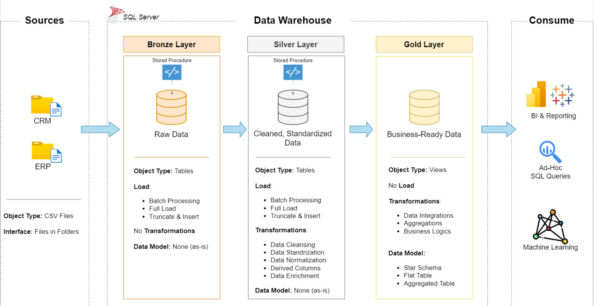

# Data Warehouse and Analytics Project

Welcome to the **Data Warehouse and Analytics Project** repository! 🚀  
This project demonstrates a comprehensive data warehousing and analytics solution, from building a data warehouse to generating actionable insights. Designed as a portfolio project, it highlights industry best practices in data engineering and analytics.

---
## 🏗️ Data Architecture

The data architecture for this project follows Medallion Architecture **Bronze**, **Silver**, and **Gold** layers:


1. **Bronze Layer**: Stores raw data as-is from the source systems. Data is ingested from CSV Files into SQL Server Database.
2. **Silver Layer**: This layer includes data cleansing, standardization, and normalization processes to prepare data for analysis.
3. **Gold Layer**: Houses business-ready data modeled into a star schema required for reporting and analytics.

  
---
## 📖 Project Overview

This project involves:

1. **Data Architecture**: Designing a Modern Data Warehouse Using Medallion Architecture **Bronze**, **Silver**, and **Gold** layers.
2. **ETL Pipelines**: Extracting, transforming, and loading data from source systems into the warehouse.
3. **Data Modeling**: Developing fact and dimension tables optimized for analytical queries.
4. **Analytics & Reporting**: Creating SQL-based reports and dashboards for actionable insights.

## 🚀 Project Requirements

### Building the Data Warehouse (Data Engineering)

#### Objective
Develop a modern data warehouse using SQL Server to consolidate sales data, enabling analytical reporting and informed decision-making.

#### Specifications
- **Data Sources**: Import data from two source systems (ERP and CRM) provided as CSV files.
- **Data Quality**: Cleanse and resolve data quality issues prior to analysis.
- **Integration**: Combine both sources into a single, user-friendly data model designed for analytical queries.
- **Scope**: Focus on the latest dataset only; historization of data is not required.
- **Documentation**: Provide clear documentation of the data model to support both business stakeholders and analytics teams.

---

### BI: Analytics & Reporting (Data Analysis)

#### Objective
Develop SQL-based analytics to deliver detailed insights into:
- **Customer Behavior**
- **Product Performance**
- **Sales Trends**

These insights empower stakeholders with key business metrics, enabling strategic decision-making.  

## 📊 Analytics & Reporting Layer

The Gold Layer provides business-ready reporting models that transform raw transactional data into actionable insights. These analytical datasets are optimized for reporting, dashboarding, KPI tracking, and decision-making.

---

## Reporting Data Mart

| Report                            | Description                                                  | Business Area        |
| --------------------------------- | ------------------------------------------------------------ | -------------------- |
| `gold.report_customers`           | Customer behavior, segmentation, and lifetime value analysis | Customer Analytics   |
| `gold.report_products`            | Product performance and revenue contribution analysis        | Product Analytics    |
| `gold.report_sales`               | Sales trends and revenue performance monitoring              | Sales Analytics      |
| `gold.report_customer_segments`   | Customer segmentation and purchasing patterns                | Marketing Analytics  |
| `gold.report_product_categories`  | Category-level performance and profitability                 | Product Analytics    |
| `gold.report_geography`           | Regional sales and customer distribution analysis            | Geographic Analytics |
| `gold.report_monthly_performance` | Monthly business KPIs and growth metrics                     | Executive Reporting  |
| `gold.report_retention`           | Customer retention and repeat purchase analysis              | Customer Success     |
| `gold.report_top_products`        | Top-selling and highest-revenue products                     | Product Management   |
| `gold.report_top_customers`       | Highest-value customer analysis                              | Customer Management  |

---

## 👥 Customer Report (`gold.report_customers`)

### Purpose

Provides a consolidated view of customer demographics, purchasing behavior, and lifetime value metrics.

### Metrics

| Metric                | Description                 |
| --------------------- | --------------------------- |
| Total Orders          | Number of orders placed     |
| Total Sales           | Total revenue generated     |
| Total Quantity        | Total units purchased       |
| Total Products        | Distinct products purchased |
| Lifespan (Months)     | Active customer duration    |
| Average Order Value   | Revenue per order           |
| Average Monthly Spend | Monthly customer spending   |
| Recency               | Months since last purchase  |

### Customer Segments

| Segment | Criteria                        |
| ------- | ------------------------------- |
| VIP     | High-value customers            |
| Regular | Consistent purchasing customers |
| New     | Recently acquired customers     |

---

## 📦 Product Report (`gold.report_products`)

### Purpose

Analyzes product performance, customer demand, and revenue generation.

### Metrics

| Metric                  | Description                   |
| ----------------------- | ----------------------------- |
| Total Orders            | Orders containing the product |
| Total Sales             | Product revenue               |
| Total Quantity Sold     | Units sold                    |
| Total Customers         | Unique purchasing customers   |
| Product Lifespan        | Active selling period         |
| Average Order Revenue   | Revenue per order             |
| Average Monthly Revenue | Revenue generated per month   |
| Recency                 | Months since last sale        |

### Product Segments

| Segment        | Criteria                        |
| -------------- | ------------------------------- |
| High Performer | Top revenue-generating products |
| Mid-Range      | Moderate performance products   |
| Low Performer  | Underperforming products        |

---

## 💰 Sales Report (`gold.report_sales`)

### Purpose

Tracks overall business performance and sales trends.

### Metrics

| Metric              | Description                  |
| ------------------- | ---------------------------- |
| Total Revenue       | Gross sales revenue          |
| Total Orders        | Number of transactions       |
| Total Customers     | Active customers             |
| Average Order Value | Revenue per order            |
| Monthly Revenue     | Revenue by month             |
| Revenue Growth %    | Period-over-period growth    |
| Sales Trend         | Historical sales performance |

### Business Questions

* How is revenue trending over time?
* Which periods generate the highest sales?
* What is the overall growth rate?

---

## 🌎 Geography Report (`gold.report_geography`)

### Purpose

Analyzes sales performance across countries, regions, and cities.

### Metrics

| Metric                       | Description             |
| ---------------------------- | ----------------------- |
| Total Revenue                | Revenue by geography    |
| Total Customers              | Customers per region    |
| Total Orders                 | Orders by location      |
| Average Revenue per Customer | Regional customer value |

### Business Questions

* Which regions generate the most revenue?
* Where are the highest-value customers located?
* Which markets show growth opportunities?

---

## 📈 Monthly Performance Report (`gold.report_monthly_performance`)

### Purpose

Provides executive-level KPI tracking and trend analysis.

### Metrics

| KPI                 | Description             |
| ------------------- | ----------------------- |
| Revenue             | Monthly revenue         |
| Orders              | Monthly order volume    |
| Customers           | Active customers        |
| Products Sold       | Total products sold     |
| Average Order Value | Monthly AOV             |
| Growth Rate         | Month-over-month growth |

---

## 🔄 Customer Retention Report (`gold.report_retention`)

### Purpose

Measures customer loyalty and repeat purchase behavior.

### Metrics

| Metric               | Description                   |
| -------------------- | ----------------------------- |
| Repeat Customers     | Returning customers           |
| Retention Rate       | Customer retention percentage |
| Churn Rate           | Lost customers percentage     |
| Repeat Purchase Rate | Multiple-order customers      |

---

## 🏆 Executive Dashboard KPIs

The reporting layer supports executive dashboards with the following KPIs:

| KPI                     | Description                |
| ----------------------- | -------------------------- |
| Total Revenue           | Overall sales revenue      |
| Total Customers         | Customer count             |
| Total Products Sold     | Units sold                 |
| Average Order Value     | Revenue per order          |
| Customer Lifetime Value | Average customer value     |
| Retention Rate          | Customer loyalty metric    |
| Revenue Growth %        | Business growth indicator  |
| Top Product             | Highest-performing product |
| Top Customer            | Highest-value customer     |

---

## 🎯 Business Value

The Gold Layer serves as the enterprise reporting foundation by providing:

* Single Source of Truth
* Customer 360 Analytics
* Product Performance Monitoring
* Sales Trend Analysis
* Executive KPI Reporting
* Revenue Optimization Insights
* Customer Retention Tracking
* Data-Driven Decision Making


## 📂 Repository Structure
```
data-warehouse-project/
│
├── datasets/                           # Raw datasets used for the project (ERP and CRM data)
│
├── docs/                               # Project documentation and architecture details
│   ├── etl.drawio                      # Draw.io file shows all different techniquies and methods of ETL
│   ├── data_architecture.drawio        # Draw.io file shows the project's architecture
│   ├── data_catalog.md                 # Catalog of datasets, including field descriptions and metadata
│   ├── data_flow.drawio                # Draw.io file for the data flow diagram
│   ├── data_models.drawio              # Draw.io file for data models (star schema)
│   ├── naming-conventions.md           # Consistent naming guidelines for tables, columns, and files
│
│
├── scripts/                            # SQL scripts for ETL and transformations
│   ├── bronze/                         # Scripts for extracting and loading raw data
│   ├── silver/                         # Scripts for cleaning and transforming data
│   ├── gold/                           # Scripts for creating analytical models
│
├── tests/                              # Test scripts and quality files
│
├── README.md                           # Project overview and instructions
├── LICENSE                             # License information for the repository
├── .gitignore                          # Files and directories to be ignored by Git
└── requirements.txt                    # Dependencies and requirements for the project
```
---


